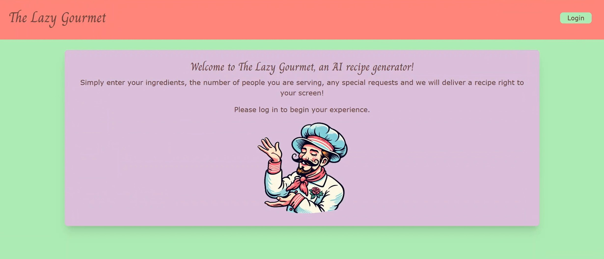

  
  # The Lazy Gourmet

  ## Description 

  Have you ever found yourself stuck at home with a few sparse ingredients, unsure of how to combine them into a culinary masterpiece? Well look no further than The Lazy Gourmet! Our wonderful lineup of charismatic AI chefs would be happy to whip up a recipe to suit your exact situation.

  

  ## Table of Contents

  - [Installation](#installation)
  - [Usage](#usage)
  - [License](#license)
  - [Contributors](#contributors)
  - [Tests](#tests)
  - [Future Development](#future-development)

  ## Installation

  If you'd like to run this program locally, simply download the files and load them up in your IDE of choice. Create a .env file in the server directory and specify DB information and API keys. Run npm i, npm run start:dev, npm run seed. Then, the application should be running locally on port 3000.

  ## Usage

  To use this application, simply fill out the fields in the form on the landing page and watch a new recipe populate below.
  
  [Demo Video](/The%20Lazy%20Gourmet%20Demo.mp4) 

  ## License

  This application is covered under the [MIT](https://opensource.org/licenses/MIT) license.

  ## Contributors

  [els-or](https://github.com/els-or)

  [lunledev](https://github.com/lunledev)

  [michaelhdavies](https://github.com/michaelhdavies)

  [SayedMK](https://github.com/SayedMK)

  ## Tests

  Load up the application following the installation process and watch the console for any errors.

  ## Future Development
  
  Keep up with future updates on the GitHub repo.

  GitHub: [The-Lazy-Gourmet](https://github.com/els-or/The-Lazy-Gourmet)

  [Back to Top](#the-lazy-gourmet)
  
  